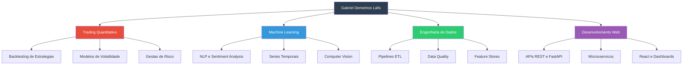
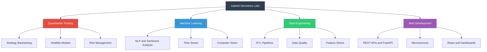

# Gabriel Demetrios Lafis

[Portugues](#portugues) | [English](#english)

---

## Portugues

### Sobre

Formado em Ciencia de Dados, baseado no Brasil. Trabalho com analise de dados, machine learning e engenharia de dados, com foco em aplicacoes para mercados financeiros e trading quantitativo.

### Areas de Atuacao

### Stack Tecnologica

| Categoria | Tecnologias |
|-----------|-------------|
| **Linguagens** | Python, SQL, R, JavaScript, TypeScript, Rust, Java, Go, Scala, Julia |
| **Data & ML** | pandas, NumPy, scikit-learn, XGBoost, LightGBM, TensorFlow, PyTorch, Spark, dbt, Airflow, MLflow |
| **Web & Infra** | FastAPI, React, Node.js, Docker, Kubernetes, Terraform, PostgreSQL, Redis |
| **Cloud** | AWS, GCP, Azure |
| **Visualizacao** | Matplotlib, Seaborn, Plotly, Tableau, Power BI |

### Contato

- LinkedIn: [Gabriel Demetrios Lafis](https://linkedin.com/in/gabriel-demetrios-lafis)
- GitHub: [github.com/galafis](https://github.com/galafis)

---

## English

### About

Data Science graduate based in Brazil. I work with data analysis, machine learning, and data engineering, focusing on financial markets and quantitative trading applications.

### Areas of Expertise

### Tech Stack

| Category | Technologies |
|----------|-------------|
| **Languages** | Python, SQL, R, JavaScript, TypeScript, Rust, Java, Go, Scala, Julia |
| **Data & ML** | pandas, NumPy, scikit-learn, XGBoost, LightGBM, TensorFlow, PyTorch, Spark, dbt, Airflow, MLflow |
| **Web & Infra** | FastAPI, React, Node.js, Docker, Kubernetes, Terraform, PostgreSQL, Redis |
| **Cloud** | AWS, GCP, Azure |
| **Visualization** | Matplotlib, Seaborn, Plotly, Tableau, Power BI |

### Contact

- LinkedIn: [Gabriel Demetrios Lafis](https://linkedin.com/in/gabriel-demetrios-lafis)
- GitHub: [github.com/galafis](https://github.com/galafis)
