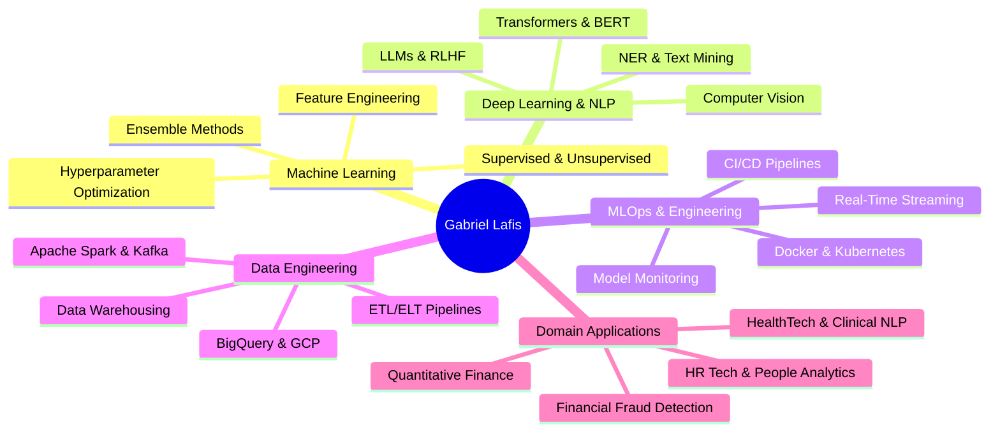

<div align="center">


<br/>

[](https://www.linkedin.com/in/gabriel-demetrios-lafis/)
[](https://github.com/galafis)
[](mailto:gabrieldemetrios@gmail.com)
[](https://github.com/galafis)

</div>

---

## About Me

Data Scientist with hands-on experience in **Machine Learning**, **Deep Learning**, and **Generative AI** (LLMs/RLHF), working across the full lifecycle: ETL/ELT, predictive modeling, deployment, MLOps, and monitoring. Background in **real-time fraud detection** (30K+ transactions/day), **LLM refinement with RLHF**, and **analytical solutions on GCP**.

Currently pursuing a **Postgraduate in AI & Health Data Science** at Instituto Sírio-Libanês and an **MBA in Data Science & AI** at USP/Esalq.

- Based in **Curitiba, PR, Brazil**
- **454+** public repositories across **10+ languages**
- Certified by **Google**, **IBM**, **Johns Hopkins** & **Wharton**
- Open to opportunities in **Data Science**, **MLOps** & **GenAI**

---

## Tech Stack

### Languages


### Machine Learning & AI


### Data Engineering & MLOps


### Cloud & Databases


### BI & Visualization


---

## Featured Projects

<table>
<tr>
<td width="50%">

### [Real-Time Fraud Detection](https://github.com/galafis/ai-financial-fraud-detection)
Ensemble of 4 models (RF, XGBoost, Neural Networks, Autoencoders) with end-to-end MLOps pipeline. **AUC 0.94** | Latency < 200ms | 30K+ transactions/day.

`Python` `TensorFlow` `XGBoost` `MLflow` `Kafka`

</td>
<td width="50%">

### [HFT Analytics Platform](https://github.com/galafis/high-frequency-trading-analytics)
Real-time analytics processing **10K+ events/second** for market microstructure insights, trading signal generation, and performance monitoring.

`Python` `PySpark` `Kafka` `PostgreSQL`

</td>
</tr>
<tr>
<td width="50%">

### [Clinical NLP Pipeline (PT-BR)](https://github.com/galafis/clinical-nlp-pipeline-ptbr)
Medical entity extraction (ICD-10, medications, symptoms) from clinical texts using **BERTimbau/BioBERTpt** Transformers with optimized NER F1-score.

`Python` `Transformers` `NER` `FastAPI`

</td>
<td width="50%">

### [Genomic Data Analysis Pipeline](https://github.com/galafis/genomic-data-analysis-pipeline)
End-to-end pipeline for DNA-seq, RNA-seq, single-cell & ChIP-seq workflows with **ML-based insights** on HPC and cloud (AWS, GCP, Azure).

`Python` `Bioinformatics` `ML` `Cloud`

</td>
</tr>
<tr>
<td width="50%">

### [HR AI Fairness Toolkit](https://github.com/galafis/hr-ai-fairness-toolkit)
Fairness auditing for HR models: 5 metrics (Disparate Impact, Demographic Parity, Equal Opportunity), SHAP by group, 3 mitigation techniques, automated HTML reports. **62 tests**.

`Python` `Fairlearn` `SHAP` `FastAPI` `Docker`

</td>
<td width="50%">

### [Org Network Analysis (ONA)](https://github.com/galafis/org-network-analysis-ona)
Organizational Network Analysis with NetworkX: centrality metrics, bottleneck detection, knowledge loss risk, Louvain community detection, executive recommendations. **68 tests**.

`Python` `NetworkX` `FastAPI` `Streamlit`

</td>
</tr>
<tr>
<td width="50%">

### [HR Turnover Risk MLOps](https://github.com/galafis/hr-turnover-risk-mlops)
End-to-end MLOps pipeline for predicting employee turnover risk with automated retraining, model monitoring, and drift detection.

`Python` `MLflow` `Docker` `CI/CD`

</td>
<td width="50%">

### [HR Policy LLM RAG Assistant](https://github.com/galafis/hr-policy-llm-rag-assistant)
RAG-powered assistant for HR policy Q&A using LLMs with retrieval-augmented generation over corporate policy documents.

`Python` `LangChain` `LLMs` `RAG` `FastAPI`

</td>
</tr>
</table>

> **450+ repositories** spanning Data Science, ML/AI, Data Engineering, Quantitative Finance, HealthTech, HR Tech, and more. [Explore all repositories →](https://github.com/galafis?tab=repositories)

---

## Certifications

<table>
<tr>
<td align="center" width="25%">
<br/>
<sub><b>Advanced Data Analytics</b></sub><br/>
<sub><b>Data Analytics</b></sub>
</td>
<td align="center" width="25%">
<br/>
<sub><b>AI Engineering</b></sub><br/>
<sub><b>Data Engineering</b></sub><br/>
<sub><b>Machine Learning</b></sub><br/>
<sub><b>GenAI Engineering</b></sub><br/>
<sub><b>Deep Learning</b></sub><br/>
<sub><b>Data Science</b></sub>
</td>
<td align="center" width="25%">
<br/>
<sub><b>Data Science</b></sub><br/>
<sub><b>Specialization</b></sub>
</td>
<td align="center" width="25%">
<br/>
<sub><b>Business Analytics</b></sub><br/>
<sub><b>UPenn</b></sub>
</td>
</tr>
</table>

---

## Education

| Degree | Institution | Period |
|--------|-------------|--------|
| **Postgraduate — AI & Health Data Science** | Instituto Sírio-Libanês (IEP/HSL) | 2026 – 2027 |
| **MBA — Data Science, AI & Analytics** | USP / Esalq | 2026 – 2027 |
| **B.Tech — Systems Analysis & Development** | UniDomBosco | 2022 – 2025 |
| **B.Tech — Cyber Defense** | UniDomBosco | 2022 – 2025 |
| **B.Tech — IT Management** | UniDomBosco | 2022 – 2025 |
| **Data Scientist (Professional)** | EBAC | 2024 – 2025 |

---

## GitHub Analytics

<div align="center">


<br/>


<br/>


</div>

---

## Experience Highlights

```
Analista de Dados / Cientista de Dados  —  trade2go          (Out/2025 – Mar/2026)
├── Full ML/AI cycle (POC → Production): regression, classification, clustering
├── EDA on 2M+ records datasets, identifying business KPI patterns
└── 6+ dashboards (Power BI, Looker Studio) | SQL optimization (+40% performance)

Data Science Researcher              —  Manus AI            (Mar/2025 – Present)
├── R&D in AI / ML / Deep Learning: 5+ architectures benchmarked
└── Feature engineering on 80+ raw features (+8% accuracy improvement)

Analista de Cibersegurança           —  Sicredi PJ/Contt    (Jan/2023 – Jun/2025)
├── Real-time fraud detection: RF, XGBoost, Neural Nets, Autoencoders (-28% FP)
├── MLOps pipeline: Python, TensorFlow, Kafka, Spark, MLflow (99.2% uptime)
└── Anomaly detection contributing to -15% in financial losses

Estagiário Dev Fullstack             —  EBANX               (Mar/2022 – Jan/2023)
├── Scalable web applications (PHP, JS, HTML5, CSS)
└── MySQL query optimization (-25% response time)
```

---

## Domain Expertise


```mermaid
mindmap
  root((Gabriel Lafis))
    Machine Learning
      Supervised & Unsupervised
      Ensemble Methods
      Hyperparameter Optimization
      Feature Engineering
    Deep Learning & NLP
      Transformers & BERT
      LLMs & RLHF
      NER & Text Mining
      Computer Vision
    MLOps & Engineering
      CI/CD Pipelines
      Model Monitoring
      Docker & Kubernetes
      Real-Time Streaming
    Data Engineering
      ETL/ELT Pipelines
      Apache Spark & Kafka
      Data Warehousing
      BigQuery & GCP
    Domain Applications
      Financial Fraud Detection
      HealthTech & Clinical NLP
      Quantitative Finance
      HR Tech & People Analytics
```

---

<div align="center">

### Let's Connect

I'm always open to discussing **Data Science**, **MLOps architectures**, or **AI applications** in Finance, Health, and HR.

[](https://www.linkedin.com/in/gabriel-demetrios-lafis/)
[](mailto:gabrieldemetrios@gmail.com)

---

<sub>Curitiba, PR, Brazil | Open to remote & hybrid opportunities</sub>

</div>
