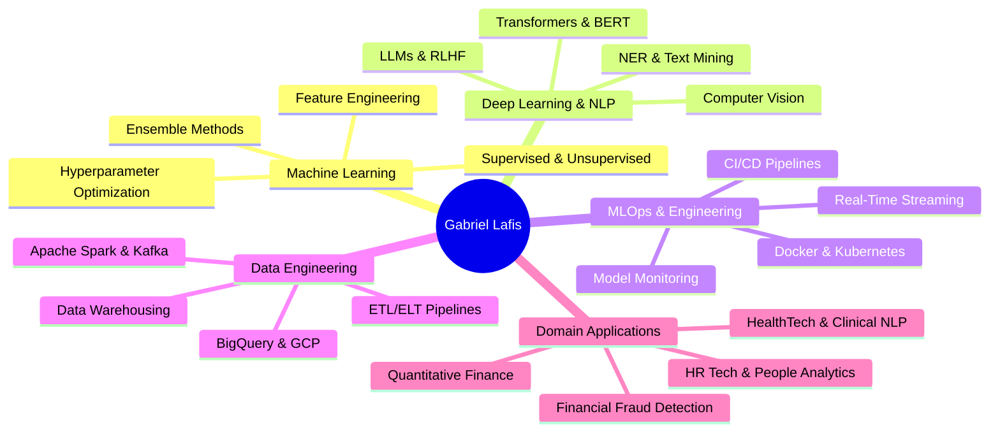

<!-- robotics-portfolio:start -->
## Robotics, Accessibility & Education

Three working prototypes with concrete **Unitree Go2 PRO development roadmaps**, reproducible examples, and detailed English/Portuguese documentation.

| Project | Working prototype | Explore |
|---|---|---|
| **[Accessible Route Lab](https://github.com/galafis/accessible-route-lab)** | Editable route maps, clearance experiments, written directions, and step-by-step simulation | [Live demo](https://galafis.github.io/accessible-route-lab/) · [Go2 PRO roadmap](https://github.com/galafis/accessible-route-lab/blob/main/docs/UNITREE_GO2_ROADMAP.md) |
| **[Rescue Scenario Lab](https://github.com/galafis/rescue-scenario-lab)** | Search exercises, communication gaps, resource accounting, and reproducible debriefs | [Live demo](https://galafis.github.io/rescue-scenario-lab/) · [Go2 PRO roadmap](https://github.com/galafis/rescue-scenario-lab/blob/main/docs/UNITREE_GO2_ROADMAP.md) |
| **[Inclusive Session Studio](https://github.com/galafis/inclusive-session-studio)** | Predictable activity plans, participant-controlled pacing, optional timers, and local exports | [Live demo](https://galafis.github.io/inclusive-session-studio/) · [Go2 PRO roadmap](https://github.com/galafis/inclusive-session-studio/blob/main/docs/UNITREE_GO2_ROADMAP.md) |

**64 behavioral tests** across the portfolio · Browser demos · Versioned examples · MIT-licensed source

*Protótipos funcionais de robótica, acessibilidade e educação, com exemplos reproduzíveis, documentação bilíngue e etapas concretas de desenvolvimento com o Unitree Go2 PRO.*

Independent research and development · **gabrieldemetrioslafis@usp.br**

---
<!-- robotics-portfolio:end -->

 

---

## About Me · Sobre Mim

**English**

Senior Data Scientist at **SysMap Solutions**, working in **Senior Machine Learning Engineering at Natura through SysMap**. My work spans Data Science, Data Engineering, and MLOps: exploratory analysis, predictive modeling, feature engineering, training and inference pipelines, model serving, monitoring, and production governance.

I also participate independently in **AGI Club, an iFood Labs initiative**, with a research focus on language models, particularly SLMs. Previously, I worked as a freelance Data Science Researcher at **Manus AI from March 2025 to April 2026**, alongside earlier experience in analytics, fraud detection, cybersecurity, and full-stack development.

Currently pursuing a **Postgraduate in AI & Health Data Science** at Instituto Sírio-Libanês and an **MBA in Data Science & AI** at USP/Esalq. Based in **Curitiba, Paraná, Brazil**.

**Português**

Cientista de Dados Sênior na **SysMap Solutions**, com atuação em **Engenharia de Machine Learning Sênior na Natura por meio da SysMap**. Meu trabalho abrange Ciência de Dados, Engenharia de Dados e MLOps: análise exploratória, modelagem preditiva, engenharia de atributos, pipelines de treinamento e inferência, disponibilização de modelos, monitoramento e governança em produção.

Também participo de forma independente do **AGI Club, iniciativa do iFood Labs**, com foco de pesquisa em modelos de linguagem, especialmente SLMs. Anteriormente, atuei como Pesquisador em Ciência de Dados freelance na **Manus AI, de março de 2025 a abril de 2026**, além de experiências em análise de dados, detecção de fraudes, cibersegurança e desenvolvimento full stack.

Atualmente curso **pós-graduação em IA e Ciência de Dados em Saúde** no Instituto Sírio-Libanês e **MBA em Ciência de Dados e IA** na USP/Esalq. Estou em **Curitiba, Paraná, Brasil**.

**Professional credentials · Credenciais profissionais:** Google, IBM, Johns Hopkins & Wharton.

**Open to opportunities · Aberto a oportunidades:** Data Science / Ciência de Dados, MLOps & Generative AI / IA Generativa.

---

## Professional Experience · Experiência Profissional

[English](#experience-english) · [Português](#experiencia-portugues)

### English

#### SysMap Solutions — Senior Data Scientist

**March 2026 – Present · Full-time · Remote · Curitiba, Paraná, Brazil**

Working in senior Machine Learning Engineering, with responsibilities across Data Science, Data Engineering, MLOps, and ML platforms. My scope covers the model lifecycle from exploration and prototyping to deployment, monitoring, and production governance. The Natura role below is a client assignment through SysMap.

- Conduct exploratory data analysis, predictive modeling, model validation, feature engineering, and data-driven experimentation to support business decisions.
- Design and improve end-to-end data and ML pipelines for training, validation, and inference, with model versioning, continuous monitoring, and CI/CD.
- Develop REST APIs and microservices for production model serving and integration, define engineering practices, and mentor junior professionals.

**Selected technologies:** Python, Databricks, MLOps, ML pipelines, REST APIs, CI/CD.

#### Natura — Senior Machine Learning Engineer, through SysMap Solutions

**March 2026 – Present · Full-time client assignment through SysMap · Remote · Curitiba, Paraná, Brazil**

Working at Natura through SysMap's outsourcing engagement, contributing to the development and operation of machine learning solutions alongside data engineering, data science, and data-product teams.

- Develop and validate predictive models, features, and experiments for business use cases such as forecasting, process optimization, and personalization.
- Build training, validation, and inference pipelines, with model versioning, monitoring, and CI/CD practices.
- Develop model-serving APIs and microservices with attention to security, observability, scalability, and reliability.

**Selected technologies:** Python, Scikit-Learn, MLOps, model serving, data engineering.

#### iFood Labs — AGI Club · Data Scientist

**April 2026 – Present · Independent activity / self-employed · Remote · Curitiba, Paraná, Brazil**

Selected member of **AGI Club**, an iFood Labs initiative bringing together professionals, researchers, and entrepreneurs from across Brazil. This entry describes independent participation in the research and study community.

- Participate in the study group, technical discussions, and collaborative exploration of approaches to artificial general intelligence.
- Focus my research and development on language models, particularly small language models (SLMs) and related approaches, including supervised and unsupervised learning.
- Exchange technical knowledge with professionals from different organizations and contribute to the Brazilian research community.

**Selected areas and tools:** Language models, SLMs, data engineering, MLflow.

#### Manus AI — Data Science Researcher

**March 2025 – April 2026 · Freelance · Remote · Curitiba, Paraná, Brazil**

Conducted applied research and development in artificial intelligence, statistical modeling, and machine learning across the research lifecycle, from quantitative analysis and data exploration to algorithm development, prototyping, and validation.

- Designed and implemented predictive models and conducted experiments to evaluate their performance.
- Developed features and translated analytical findings into insights supporting product capabilities, user experience, and data-driven decisions.
- Combined exploratory data analysis, statistical methods, and model validation in applied research work.

**Selected areas:** Data Science, exploratory data analysis, statistical modeling, Machine Learning, Deep Learning, feature engineering.

#### trade2go — Data Analyst / Data Scientist

**October 2025 – March 2026**

- Worked across the model lifecycle from proof of concept to production, including regression, classification, and clustering.
- Performed exploratory analysis on datasets with more than 2 million records to identify patterns in business indicators.
- Developed six or more dashboards with Power BI and Looker Studio and improved SQL performance by 40%.

#### Sicredi PJ/Contt — Cybersecurity Analyst

**January 2023 – June 2025**

- Worked on real-time fraud detection using Random Forest, XGBoost, and neural networks, with a 28% reduction in false positives.
- Contributed to an MLOps pipeline using Python, TensorFlow, Kafka, Spark, and MLflow, with 99.2% uptime.
- Developed anomaly-detection work contributing to a 15% reduction in financial losses.

#### EBANX — Full-Stack Development Intern

**March 2022 – January 2023**

- Developed web applications using PHP, JavaScript, HTML5, and CSS.
- Optimized MySQL queries, reducing response times by 25%.

[Back to language selection](#professional-experience)

---

### Português

#### SysMap Solutions — Cientista de Dados Sênior

**Março de 2026 – Atual · Tempo integral · Remoto · Curitiba, Paraná, Brasil**

Atuação em Engenharia de Machine Learning Sênior, com responsabilidades em Ciência de Dados, Engenharia de Dados, MLOps e plataformas de ML. Meu escopo abrange o ciclo de vida dos modelos, da exploração e prototipagem à implantação, ao monitoramento e à governança em produção. A atuação na Natura, descrita abaixo, ocorre por meio da SysMap.

- Conduzo análises exploratórias, modelagem preditiva, validação de modelos, engenharia de atributos e experimentação orientada a dados para apoiar decisões de negócio.
- Projeto e evoluo pipelines de dados e ML para treinamento, validação e inferência, com versionamento de modelos, monitoramento contínuo e CI/CD.
- Desenvolvo APIs REST e microsserviços para disponibilização e integração de modelos em produção, defino práticas de engenharia e apoio a mentoria de profissionais juniores.

**Tecnologias selecionadas:** Python, Databricks, MLOps, pipelines de ML, APIs REST e CI/CD.

#### Natura — Engenheiro de Machine Learning Sênior, por meio da SysMap Solutions

**Março de 2026 – Atual · Alocação em tempo integral por meio da SysMap · Remoto · Curitiba, Paraná, Brasil**

Atuação na Natura por meio da parceria de outsourcing com a SysMap, contribuindo para o desenvolvimento e a operação de soluções de machine learning junto a equipes de engenharia de dados, ciência de dados e produtos de dados.

- Desenvolvo e valido modelos preditivos, atributos e experimentos para casos de negócio como previsão, otimização de processos e personalização.
- Construo pipelines de treinamento, validação e inferência, com práticas de versionamento, monitoramento e CI/CD.
- Desenvolvo APIs e microsserviços para disponibilizar modelos em produção, com atenção a segurança, observabilidade, escalabilidade e confiabilidade.

**Tecnologias selecionadas:** Python, Scikit-Learn, MLOps, disponibilização de modelos e engenharia de dados.

#### iFood Labs — AGI Club · Cientista de Dados

**Abril de 2026 – Atual · Atividade independente / autônomo · Remoto · Curitiba, Paraná, Brasil**

Membro selecionado do **AGI Club**, iniciativa do iFood Labs que reúne profissionais, pesquisadores e empreendedores de todo o Brasil. Esta experiência corresponde à participação independente na comunidade de pesquisa e estudos.

- Participo do grupo de estudos, de discussões técnicas e da exploração colaborativa de abordagens para inteligência artificial geral.
- Concentro minha pesquisa e desenvolvimento em modelos de linguagem, especialmente modelos de linguagem de pequeno porte (SLMs) e abordagens relacionadas, incluindo aprendizado supervisionado e não supervisionado.
- Compartilho conhecimento técnico com profissionais de diferentes organizações e contribuo para a comunidade brasileira de pesquisa.

**Áreas e ferramentas selecionadas:** Modelos de linguagem, SLMs, engenharia de dados e MLflow.

#### Manus AI — Pesquisador em Ciência de Dados

**Março de 2025 – Abril de 2026 · Freelance · Remoto · Curitiba, Paraná, Brasil**

Realizei pesquisa e desenvolvimento aplicados em inteligência artificial, modelagem estatística e machine learning, da análise quantitativa e exploração de dados ao desenvolvimento de algoritmos, à prototipagem e à validação.

- Projetei e implementei modelos preditivos e conduzi experimentos para avaliar seu desempenho.
- Desenvolvi atributos e traduzi resultados analíticos em informações para apoiar funcionalidades de produto, experiência do usuário e decisões orientadas a dados.
- Combinei análise exploratória, métodos estatísticos e validação de modelos em projetos de pesquisa aplicada.

**Áreas selecionadas:** Ciência de Dados, análise exploratória, modelagem estatística, Machine Learning, Deep Learning e engenharia de atributos.

#### trade2go — Analista de Dados / Cientista de Dados

**Outubro de 2025 – Março de 2026**

- Atuei no ciclo de vida dos modelos, da prova de conceito à produção, incluindo regressão, classificação e agrupamento.
- Realizei análises exploratórias em conjuntos com mais de 2 milhões de registros para identificar padrões em indicadores de negócio.
- Desenvolvi seis ou mais painéis com Power BI e Looker Studio e melhorei o desempenho de consultas SQL em 40%.

#### Sicredi PJ/Contt — Analista de Cibersegurança

**Janeiro de 2023 – Junho de 2025**

- Atuei na detecção de fraudes em tempo real com Random Forest, XGBoost e redes neurais, com redução de 28% nos falsos positivos.
- Contribuí para um pipeline de MLOps com Python, TensorFlow, Kafka, Spark e MLflow, com disponibilidade de 99,2%.
- Desenvolvi trabalhos de detecção de anomalias que contribuíram para reduzir perdas financeiras em 15%.

#### EBANX — Estagiário de Desenvolvimento Full Stack

**Março de 2022 – Janeiro de 2023**

- Desenvolvi aplicações web com PHP, JavaScript, HTML5 e CSS.
- Otimizei consultas MySQL, reduzindo os tempos de resposta em 25%.

[Voltar à seleção de idioma](#professional-experience)

---

## Tech Stack

### Languages

### Machine Learning & AI

### Data Engineering & MLOps

### Cloud & Databases

### BI & Visualization

---

## Featured Projects

<table>
<tr>
<td width="50%">

### [Real-Time Fraud Detection](https://github.com/galafis/ai-financial-fraud-detection)
Ensemble of 4 models (RF, XGBoost, Neural Networks, Autoencoders) with end-to-end MLOps pipeline. **AUC 0.94** | Latency < 200ms | 30K+ transactions/day.

`Python` `TensorFlow` `XGBoost` `MLflow` `Kafka`

</td>
<td width="50%">

### [HFT Analytics Platform](https://github.com/galafis/high-frequency-trading-analytics)
Real-time analytics processing **10K+ events/second** for market microstructure insights, trading signal generation, and performance monitoring.

`Python` `PySpark` `Kafka` `PostgreSQL`

</td>
</tr>
<tr>
<td width="50%">

### [Clinical NLP Pipeline (PT-BR)](https://github.com/galafis/clinical-nlp-pipeline-ptbr)
Medical entity extraction (ICD-10, medications, symptoms) from clinical texts using **BERTimbau/BioBERTpt** Transformers with optimized NER F1-score.

`Python` `Transformers` `NER` `FastAPI`

</td>
<td width="50%">

### [Genomic Data Analysis Pipeline](https://github.com/galafis/genomic-data-analysis-pipeline)
End-to-end pipeline for DNA-seq, RNA-seq, single-cell & ChIP-seq workflows with **ML-based insights** on HPC and cloud (AWS, GCP, Azure).

`Python` `Bioinformatics` `ML` `Cloud`

</td>
</tr>
<tr>
<td width="50%">

### [HR AI Fairness Toolkit](https://github.com/galafis/hr-ai-fairness-toolkit)
Fairness auditing for HR models: 5 metrics (Disparate Impact, Demographic Parity, Equal Opportunity), SHAP by group, 3 mitigation techniques, automated HTML reports. **62 tests**.

`Python` `Fairlearn` `SHAP` `FastAPI` `Docker`

</td>
<td width="50%">

### [Org Network Analysis (ONA)](https://github.com/galafis/org-network-analysis-ona)
Organizational Network Analysis with NetworkX: centrality metrics, bottleneck detection, knowledge loss risk, Louvain community detection, executive recommendations. **68 tests**.

`Python` `NetworkX` `FastAPI` `Streamlit`

</td>
</tr>
<tr>
<td width="50%">

### [HR Turnover Risk MLOps](https://github.com/galafis/hr-turnover-risk-mlops)
End-to-end MLOps pipeline for predicting employee turnover risk with automated retraining, model monitoring, and drift detection.

`Python` `MLflow` `Docker` `CI/CD`

</td>
<td width="50%">

### [HR Policy LLM RAG Assistant](https://github.com/galafis/hr-policy-llm-rag-assistant)
RAG-powered assistant for HR policy Q&A using LLMs with retrieval-augmented generation over corporate policy documents.

`Python` `LangChain` `LLMs` `RAG` `FastAPI`

</td>
</tr>
</table>

> **450+ repositories** spanning Data Science, ML/AI, Data Engineering, Quantitative Finance, HealthTech, HR Tech, and more. [Explore all repositories →](https://github.com/galafis?tab=repositories)

---

## Certifications

<table>
<tr>
<td align="center" width="25%">
 
<b>Advanced Data Analytics</b> 
<b>Data Analytics</b>
</td>
<td align="center" width="25%">
 
<b>AI Engineering</b> 
<b>Data Engineering</b> 
<b>Machine Learning</b> 
<b>GenAI Engineering</b> 
<b>Deep Learning</b> 
<b>Data Science</b>
</td>
<td align="center" width="25%">
 
<b>Data Science</b> 
<b>Specialization</b>
</td>
<td align="center" width="25%">
 
<b>Business Analytics</b> 
<b>UPenn</b>
</td>
</tr>
</table>

---

## Education

| Degree | Institution | Period |
|--------|-------------|--------|
| **Postgraduate — AI & Health Data Science** | Instituto Sírio-Libanês (IEP/HSL) | 2026 – 2027 |
| **MBA — Data Science, AI & Analytics** | USP / Esalq | 2026 – 2027 |
| **B.Tech — Systems Analysis & Development** | UniDomBosco | 2022 – 2025 |
| **B.Tech — Cyber Defense** | UniDomBosco | 2022 – 2025 |
| **B.Tech — IT Management** | UniDomBosco | 2022 – 2025 |
| **Data Scientist (Professional)** | EBAC | 2024 – 2025 |

---

## GitHub Analytics

 

 

---

## Domain Expertise

```mermaid
mindmap
  root((Gabriel Lafis))
    Machine Learning
      Supervised & Unsupervised
      Ensemble Methods
      Hyperparameter Optimization
      Feature Engineering
    Deep Learning & NLP
      Transformers & BERT
      LLMs & RLHF
      NER & Text Mining
      Computer Vision
    MLOps & Engineering
      CI/CD Pipelines
      Model Monitoring
      Docker & Kubernetes
      Real-Time Streaming
    Data Engineering
      ETL/ELT Pipelines
      Apache Spark & Kafka
      Data Warehousing
      BigQuery & GCP
    Domain Applications
      Financial Fraud Detection
      HealthTech & Clinical NLP
      Quantitative Finance
      HR Tech & People Analytics
```

---

### Let's Connect

I'm always open to discussing **Data Science**, **MLOps architectures**, or **AI applications** in Finance, Health, and HR.

---

Curitiba, PR, Brazil | Open to remote & hybrid opportunities

